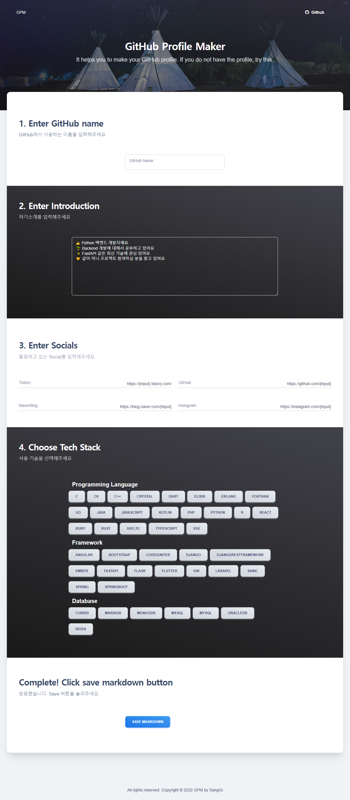
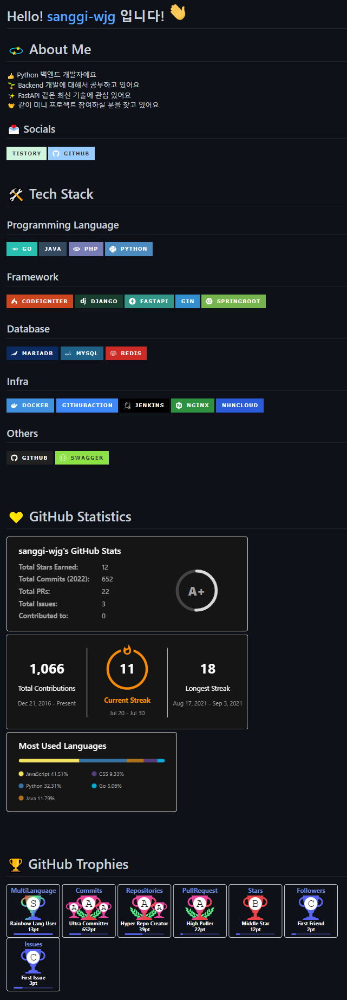

[](https://github.com/sanggi-wjg/gpm/actions/workflows/Lint_and_Test.yml)

# GPM
### GitHub Profile Maker
It helps you to make your GitHub profile. If you do not have the profile, try this.

[[Demo Site](http://15.164.50.32/)]

## Development Environment


```
Python 3.10
FastAPI (https://fastapi.tiangolo.com/)
PyDantic (https://pydantic-docs.helpmanual.io/)
Starlette (https://www.starlette.io/)
SqlAlchemy (https://www.sqlalchemy.org/)

GitHub API (https://docs.github.com/en/rest/overview/resources-in-the-rest-api)
Shield Badge (https://shields.io/)

GitHub Stat 
https://github-readme-stats.vercel.app
https://github-profile-trophy.vercel.app

Front 
Material-kit
```

## App Screenshot




## How to use own yourself
### 1. Clone this repository.
Create Virtual Env whatever you want, then install packages with requirements.txt

### 2. Create `.env` file to use for app.
App load the configurations from `.env` file. Please refer to the code below.

```python
filepath = os.path.join(base, "config", environ.get('CONFIG_ENV', '.env.local'))
```

#### For example `.env.local`
```dotenv
# Enviornment
DEBUG=True
RELOAD=True
PORT=9001

# Auth
HOST="localhost"
CORS_ORIGINS=["http://localhost"]
TRUST_HOST=["localhost"]
SECRET_KEY="my-secret-key" # secret key, to get a string like this run: openssl rand -hex 32
ACCESS_TOKEN_ALGORITHM="HS256"
ACCESS_TOKEN_EXPIRE_MINUTES=30

# Performance
GZIP_MINIMUM_SIZE=500

# Database - MySQL
DATABASE_ENGINE=MYSQL
MYSQL_USER=user
MYSQL_PASSWORD=password
MYSQL_HOST=1.2.3.4
MYSQL_PORT=3306
MYSQL_DB_NAME=GPM

# Redis (not yet)
#REDIS_HOST=1.2.3.4
#REDIS_PORT=6379
```

You can also use `SQLite`. Fill `MySQL_*` with garbage.
```dotenv
# Database - MySQL
DATABASE_ENGINE=SQLITE
MYSQL_USER=1
MYSQL_PASSWORD=2
MYSQL_HOST=1.2.3.4
MYSQL_PORT=3
MYSQL_DB_NAME=4
```

### 3. Execute app/main.py
```shell
python app/main.py
```

### 4. Use Commands
#### Create User
```shell
python app/commands/managements/create_user.py -email jayg@nhn-commerce.com -password passw0rd

START Command: Create user
new_user(jayg@nhn-commerce.com) created
FINISH Command
```

#### Create Techs
```shell
python app/commands/managements/create_techs.py

START Command: Create tech categories and stacks
Create Programming Language or not
Create Python or not
Create Java or not
Create PHP or not
...
Create OracleDB or not
Create MsSQL or not
Create Cubrid or not
FINISH Command
```
